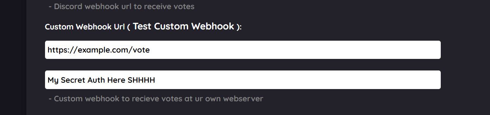

# Webhooks

## [BLWebhooks:](https://www.npmjs.com/package/blwebhooks)

### Step 1:

```javascript
npm i blwebhooks
```

### Step 2:

Now that the BLWebhooks is installed we need to add this to our main code.

```javascript
const discord = require('discord.js');
const client = discord.Client();

const blwebhooks = require("blwebhooks");

// This run on port 80
const bl = new blwebhooks.Client(client, 80);

const InfinityBotList = bl.IBLVoteHook("END URL", "AUTH", true);

// This code will run after a new vote was received from InfinityBotList
BLWEvent.on('IBL-voted', function async (userID, botID, type, timeStamp) {
  console.log(userID)
})
```

## Using The Wrapper:

### Step 1:

First lets install the wrapper from NPM.

```javascript
npm i infinity-api
```

### Step 2:

Now that the wrapper is installed we need to add this to our main code.

```javascript
const infinity = require("infinity-api") // We import our api
const IBL = new infinity("botID", "botAuth", {webPort: 3001, webPath: "/IBLhook", webAuth: "Auth you placed in custom webhooks"}); // We fill requirements

IBL.webhook.on("votes", (vote) => {
    console.log(vote) // Receive vote content
})

IBL.webhook.on("ready", console.log) // Once the webserver start u will get message
IBL.webhook.on("destroyed", console.log) // Any errors will be generated from him
```

Now everytime we receive a vote it will run the code inside the:

```javascript
IBL.webhook.on("votes", (vote) => {
    // Will Run This Code
})
```

## Using The Raw Webhook:

### Step 1:

First we need to install the required packages:

```javascript
npm i express body-parser
```

### Step 2:

Go to your bots page and click the Manage Bot button, then scroll down until your at the Custom Webhook URL part as shown below.



### Step 3:

From there you can add your Vote URL and Vote secret we would suggest using a Express server you can read more about here also we included an example below:

```javascript
  // Imports
const express = require("express")
const bodyParser = require("body-parser")

const app = express(); // Initialize express
const port = 3001; // Define a port for the webserver to run on.

app.use(bodyParser.json())

app.post("/vote", (req, res) => {
  // Respond to invalid requests
  if (req.header('Authorization') != "WEB_AUTH") return res.status(403).send(JSON.stringify({error: true, message: "You don't have access to use this endpoint"}));

  // Use the data on whatever you want
  console.log(req.body); 

 // Respond to ibl api
  res.status(200).send(JSON.stringify({error: false, message: "Received the request!"}));
})

app.listen(port, () => console.log(`Listening on port: ${port}`)) //Start the server
```

Now you can receive requests from the IBL API and make them run whatever code!

### Body Response:

| ROUTE | TYPE | OVERVIEW |
| :--- | :--- | :--- |
| timestamp | Integar | Time of vote time |
| userID | Snowflake | DiscordID of the voted user |
| botID | Snowflake | DiscordID of the bot |
| type | String | Type of request |

