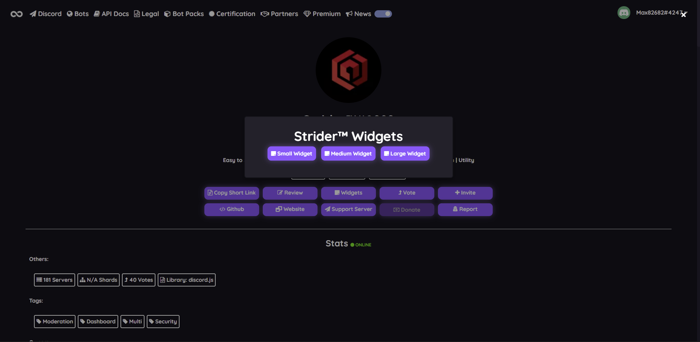

# Widget Bot

### Markdown

```text
[](https://infinitybotlist.com/bots/:botID)
```

### HTML

```text
<a href="https://infinitybotlist.com/bots/:botID" title="widget"> </img> </a>
```

### Getting Your Widget

To get it go to your bot page, and click widgets then you have 3 options:



After clicking the size you will get a link like this \([https://infinitybotlist.com/bots/:botID/widget?size=medium](https://infinitybotlist.com/bots/strider/widget?size=medium)\) and just add that to the HTML or Markdown like above.

